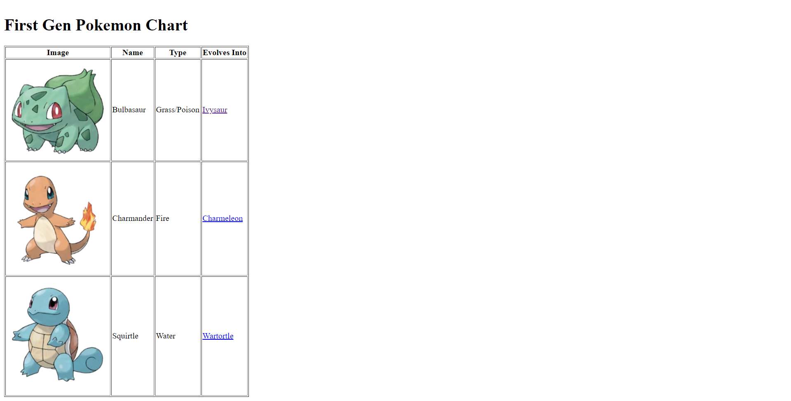
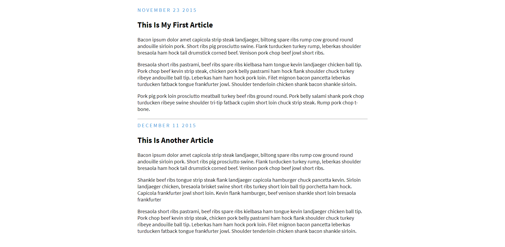

Random code bits I did for fun on my own, I did these so I could better understand what I was doing and to get some practice in. Just a bunch of random code files thrown into a folder. 

<h1 align="center"> Photo Grid</h1>

<h1 align="center"> Pokemon Page </h1>

<h1 align="center"> Blog page </h1>

